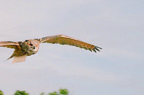

<h1 align="center"> The Beverage Viber </h1>

<p align="center">
  
</p>


<p align="center">
    
    
    
    
    
</p>

## Table of Contents
- [Table of Contents](#table-of-contents)
- [Description](#description)
- [Installation](#installation)
- [Contributions](#contributions)
- [Testing](#testing)
- [License](#license)
- [Contact](#contact)


## Description
> This project was built by Coffee and Tea aficionados.  The goal was to help with the ever internal debate of whether to have a steamy hot cup of tea, or that jittery goodness of Java Joe.  The beverage viber helps you decide if you'd like to have a Coffee or Tea, and will generate a recipe that coordiates with your choice. If you have no clue, well then let our random generator decide for you!    This was built using the node tools ```mysql2``` ``` express```  ```dotenv``` and ```sequelize```.

<p align="center">
  
</p>

> Feel free to visit and test our application [Here!](https://guarded-meadow-10732.herokuapp.com/)

## Installation
> We pulled the [npm](https://www.npmjs.com/) package, aka ```package.json```, entered ```npm install``` , and then used the ```require``` method to direct the routes for each of the items within the directory.  
> * node 
> * [NPM](https://www.npmjs.com/)
> * [MySQL2](https://www.npmjs.com/package/mysql2)
> * [Express](https://www.npmjs.com/package/express)
> * [dotenv](https://www.npmjs.com/package/dotenv)
> * [Sequelize](https://www.npmjs.com/package/sequelize)
> * [Shields IO](https://shields.io/category/license) 
> * [Open Source Initiative](https://opensource.org/licenses/BSD-3-Clause) 
> * [Handlebars](https://handlebarsjs.com/)
## Contributions
> Team JSKC!! John-Mark Sackett, Shobair Abidi, Kira Griffitt, and Catherine Upperman.  We would like to thank our TA's Ross and Andrew for their help debugging, and general moral support. Oh and thanks to our teacher Dan, for always blaming Cat for everything that went wrong, and then helping us to fix it.
## Testing
> To test the data base we used [Insomnia](https://insomnia.rest/) to run the different, GET, POST, PUT, and DELETE methods. We ran ```node server.js``` in the terminal multiple times to test the webpage, to ensure the look and functionality were there. Once we were mostly satisfied with the product, we pushed to heroku for deployment.

## License

Copyright (C) 2021 kira-cat-johnmark-shobair

        Permission is hereby granted, free of charge, to any person obtaining a copy of this software and associated documentation files (the "Software"), to deal in the Software without restriction, including without limitation the rights to use, copy, modify, merge, publish, distribute, sublicense, and/or sell copies of the Software, and to permit persons to whom the Software is furnished to do so, subject to the following conditions:
        
        The above copyright notice and this permission notice shall be included in all copies or substantial portions of the Software.
        
        THE SOFTWARE IS PROVIDED "AS IS", WITHOUT WARRANTY OF ANY KIND, EXPRESS OR IMPLIED, INCLUDING BUT NOT LIMITED TO THE WARRANTIES OF MERCHANTABILITY, FITNESS FOR A PARTICULAR PURPOSE AND NONINFRINGEMENT. IN NO EVENT SHALL THE AUTHORS OR COPYRIGHT HOLDERS BE LIABLE FOR ANY CLAIM, DAMAGES OR OTHER LIABILITY, WHETHER IN AN ACTION OF CONTRACT, TORT OR OTHERWISE, ARISING FROM, OUT OF OR IN CONNECTION WITH THE SOFTWARE OR THE USE OR OTHER DEALINGS IN THE SOFTWARE.
## Contact
* :octocat: [CatUpperman](github.com/catupperman), [John-Mark](https://github.com/Kalmnir), [Shobair](https://github.com/shobes572), [Kira](https://github.com/J1741)
* email: Cat: catupperman@gmail.com, Kira: jseventeen41@gmail.com, John-Mark: jmsackett91@gmail.com, Shobair: shobair.abidi@gmail.com
* Prefered Contact: Email or GitHub
<p align="center">
  
</p>